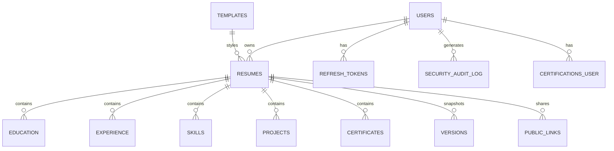

# 📄 AI Resume Builder — Project Documentation

> **Last Audit:** April 10, 2026  
> **Status:** All sections integrated and operational ✅

---

## 🏗️ Architecture Overview

```
┌──────────────────────────────────────────────────────┐
│                    BROWSER (Client)                  │
│  ┌──────────┐  ┌──────────┐  ┌──────────────────┐   │
│  │ Landing  │  │  Auth    │  │  Resume Editor   │   │
│  │  Page    │  │  Pages   │  │  + Live Preview  │   │
│  └──────────┘  └──────────┘  └──────────────────┘   │
│        │              │              │                │
│        └──────────────┼──────────────┘                │
│                       │ REST API (JSON)               │
├───────────────────────┼──────────────────────────────┤
│                    FLASK SERVER                       │
│  ┌──────────────────────────────────────────────┐    │
│  │  Auth Blueprint    │  Resume Blueprint        │    │
│  │  /api/v1/auth/*    │  /api/v1/resumes/*       │    │
│  ├────────────────────┼──────────────────────────┤    │
│  │  API Blueprint     │  Services Layer          │    │
│  │  /api/v1/ats-*     │  (Business Logic)        │    │
│  ├────────────────────┼──────────────────────────┤    │
│  │  SQLAlchemy ORM    │  Marshmallow Schemas     │    │
│  └────────────────────┴──────────────────────────┘    │
│                       │                               │
│              ┌────────┴────────┐                      │
│              │   SQLite / DB   │                      │
│              └─────────────────┘                      │
│                                                       │
│  ┌─────────────────────────────────────────────┐      │
│  │  Google Gemini API  (ATS + AI Bullet + Summary)│   │
│  └─────────────────────────────────────────────┘      │
└──────────────────────────────────────────────────────┘
```

---

## 🛠️ Tech Stack

### Backend (Python / Flask)

| Technology | Version | Purpose |
|---|---|---|
| **Flask** | 3.1.0 | Web framework (app factory pattern) |
| **Flask-SQLAlchemy** | 3.1.1 | ORM for database models |
| **SQLAlchemy** | 2.0.36 | Core ORM engine |
| **Flask-Migrate** | 4.0.7 | Database migrations (Alembic) |
| **Flask-Login** | 0.6.3 | Session-based authentication |
| **Flask-Bcrypt** | 1.0.1 | Password hashing |
| **Flask-Limiter** | 3.5.0 | Rate limiting (in-memory / Redis) |
| **Marshmallow** | 3.23.2 | Request/response validation & serialization |
| **PyJWT** | 2.10.1 | JWT token generation (refresh tokens) |
| **Authlib** | 1.4.0 | OAuth2 (Google Sign-In support) |
| **Celery** | 5.4.0 | Async task queue (ready, not actively used in Phase 1) |
| **Redis** | 5.2.0 | Caching & rate limiting backend |
| **google-genai** | 1.14.0 | Google Gemini API client for AI features |
| **Gunicorn** | 22.0.0 | Production WSGI server |
| **python-dotenv** | 1.0.1 | `.env` file loading |

### Frontend (Vanilla JS / HTML / CSS)

| Technology | Purpose |
|---|---|
| **Vanilla JavaScript (ES6+)** | Core editor logic, store, reactive data binding |
| **Tailwind CSS** (via CDN + config) | Utility-first styling for all pages |
| **GSAP** | Smooth animations, scroll-triggered effects |
| **html2pdf.js** | Client-side PDF generation and export |
| **Google Fonts** (Manrope, Fraunces) | Typography |
| **Material Symbols** | Icon library |

### Database

| Technology | Purpose |
|---|---|
| **SQLite** | Development database (file-based) |
| **PostgreSQL** (production-ready) | Configurable via `DATABASE_URL` env var |

---

## 📁 Project Structure

```
resume_bulider_project/
├── app/
│   ├── __init__.py              # Flask app factory (create_app)
│   ├── config.py                # Dev/Prod configurations
│   ├── extensions.py            # Flask extension instances
│   ├── models.py                # Central model re-exports
│   │
│   ├── auth/                    # Authentication module
│   │   ├── models.py            # User, RefreshToken, SecurityAuditLog, Certification
│   │   ├── routes.py            # /api/v1/auth/* endpoints
│   │   ├── schemas.py           # Auth request/response validation
│   │   └── services.py          # Auth business logic
│   │
│   ├── resume/                  # Resume module (core)
│   │   ├── models.py            # Resume, Education, Experience, Skill, Project,
│   │   │                        #   Certificate, Version, PublicLink, Template
│   │   ├── routes.py            # /api/v1/resumes/* endpoints
│   │   ├── schemas.py           # Resume validation schemas
│   │   ├── services.py          # Resume CRUD, versioning, sharing
│   │   └── ats_service.py       # ATS analysis (Gemini + local fallback)
│   │
│   ├── api/                     # Additional API routes
│   │   └── routes.py            # ATS analyze, AI bullet, projects/certs CRUD
│   │
│   ├── services/                # Shared services
│   │   └── ai_service.py        # Gemini API wrapper (ATS + bullet optimizer)
│   │
│   ├── common/                  # Shared utilities
│   │   └── errors.py            # AppError class + error constants
│   │
│   ├── templates/               # Jinja2 HTML templates
│   │   ├── landing.html         # Public landing page
│   │   ├── index.html           # Resume editor (authenticated)
│   │   ├── dashboard.html       # Resume list dashboard
│   │   └── auth/
│   │       ├── login.html       # Login page
│   │       └── register.html    # Registration page
│   │
│   └── static/
│       ├── css/
│       │   ├── cinematic.css            # Core cinematic theme
│       │   ├── cinematic-refactor.css   # Extended theme styles
│       │   └── unified-cinematic.css    # Unified overrides
│       └── js/
│           ├── editor.js         # Core editor: store binding, preview rendering,
│           │                     #   auto-save, ATS analysis, template engine
│           ├── store.js          # Reactive state management (Store class)
│           ├── login.js          # Login page logic
│           ├── main.js           # App entry point
│           ├── export.js         # PDF export utilities
│           ├── ui.js             # UI utilities and helpers
│           ├── session-stability.js      # Session keepalive / error recovery
│           ├── immersive3d.js            # 3D visual effects
│           ├── gsap-animations.js        # GSAP animation sequences
│           ├── gsap-orchestration.js     # GSAP orchestration layer
│           └── cinematic*.js             # Various cinematic animation modules
│
├── migrations/                  # Alembic migration files
├── tests/                       # Test suite
├── docs/                        # Extra documentation
├── seed.py                      # Database seeder (dev only)
├── requirements.txt             # Python dependencies
├── tailwind.config.js           # Tailwind CSS configuration
├── .env                         # Environment variables
├── .gitignore                   # Git exclusions
└── pytest.ini                   # Pytest configuration
```

---

## 🗃️ Database Schema

### Entity Relationship Diagram



### Tables

| Table | Key Fields | Purpose |
|---|---|---|
| `users` | id, name, email, password_hash, google_id | User accounts |
| `resumes` | id, user_id, template_id, personal_*, summary | Resume root entity |
| `education` | id, resume_id, school, degree, start_year, end_year | Education entries |
| `experience` | id, resume_id, company, role, start_date, end_date, description | Work experience |
| `skills` | id, resume_id, skill_name, level | Technical skills |
| `projects` | id, resume_id, title, description, tech_stack, github_link, demo_link | Project entries |
| `certificates` | id, resume_id, name, issuer, year | Resume-level certs |
| `certifications` | id, user_id, name, issuing_organization, issue_date, credential_url | User-level certs |
| `versions` | id, resume_id, version_no, label, data (JSON) | Resume snapshots |
| `public_links` | id, resume_id, token, expires_at | Resume sharing |
| `templates` | id, name, html_path, css_path, ats_safe | Template definitions |
| `refresh_tokens` | id, user_id, token_hash, expires_at, revoked | JWT refresh tokens |
| `security_audit_log` | id, user_id, event_type, ip_address, payload | Security events |

---

## 🔌 API Endpoints

### Authentication (`/api/v1/auth/`)

| Method | Endpoint | Description |
|---|---|---|
| `POST` | `/auth/register` | Create new user account |
| `POST` | `/auth/login` | Login (session-based) |
| `GET`  | `/auth/logout` | Logout |
| `POST` | `/auth/refresh` | Refresh JWT token |

### Resume CRUD (`/api/v1/`)

| Method | Endpoint | Description |
|---|---|---|
| `GET` | `/resumes` | List all user resumes |
| `POST` | `/resumes` | Create new resume |
| `GET` | `/resumes/:id` | Get resume details |
| `PUT` | `/resumes/:id` | Full resume update + version snapshot |
| `DELETE` | `/resumes/:id` | Delete resume |

### Resume Sections (`/api/v1/resumes/:id/`)

| Method | Endpoint | Description |
|---|---|---|
| `PUT` | `/resumes/:id/personal-info` | Update personal info |
| `PUT` | `/resumes/:id/education` | Update education entries |
| `PUT` | `/resumes/:id/experience` | Update experience entries |
| `PUT` | `/resumes/:id/skills` | Update skills list |
| `PUT` | `/resumes/:id/projects` | Update project entries ✅ |
| `PUT` | `/resumes/:id/certificates` | Update certification entries ✅ |

### Versioning & Sharing

| Method | Endpoint | Description |
|---|---|---|
| `GET` | `/resumes/:id/versions` | List version history |
| `GET` | `/resumes/:id/versions/:no` | Get specific version snapshot |
| `POST` | `/resumes/:id/versions/:no/revert` | Revert to version |
| `POST` | `/resumes/:id/share` | Generate public share link |
| `DELETE` | `/resumes/:id/share` | Revoke share link |
| `GET` | `/public/:token` | View shared resume (public) |

### AI Features

| Method | Endpoint | Description |
|---|---|---|
| `POST` | `/resumes/:id/ats-analyze` | ATS analysis (Gemini + local) |
| `POST` | `/resumes/:id/summary-generate` | AI professional summary |
| `POST` | `/ai/optimize-bullet` | AI bullet point optimizer |

### Projects & Certifications (Additional API)

| Method | Endpoint | Description |
|---|---|---|
| `GET` | `/projects?resume_id=` | List projects by resume |
| `POST` | `/projects` | Create project |
| `PUT` | `/projects/:id` | Update project |
| `DELETE` | `/projects/:id` | Delete project |
| `GET` | `/certifications` | List user certifications |
| `POST` | `/certifications` | Create certification |
| `DELETE` | `/certifications/:id` | Delete certification |

---

## 🔄 Data Flow: Form → Preview → Save

```
User types in form input
        │
        ▼
[data-bind="projects.0.title"]  →  input event  →  store.update('projects.0.title', value)
        │
        ▼
store emits '*' event  →  renderPreview(state)  →  Live preview updates instantly
        │
        ▼
Debounced (1s)  →  saveSectionData('projects.0.title')
        │
        ▼
path.startsWith('projects')  →  PUT /api/v1/resumes/:id/projects
        │
        ▼
Backend: update_resume_section()  →  Clears old → Inserts new  →  DB commit
```

---

## 📋 Resume Sections — Integration Audit

| Section | Store | Form Inputs | Preview Render | Backend Save | Backend Load | Status |
|---|---|---|---|---|---|---|
| **Personal Info** | `personal.*` | ✅ data-bind | ✅ Header | ✅ PUT personal-info | ✅ mapBackendToStore | ✅ PASS |
| **Summary** | `summary` | ✅ data-bind | ✅ summaryBlock | ✅ PUT (with personal) | ✅ mapBackendToStore | ✅ PASS |
| **Education** | `education[]` | ✅ data-bind | ✅ educationBlock | ✅ PUT /education | ✅ mapBackendToStore | ✅ PASS |
| **Experience** | `experience[]` | ✅ data-bind | ✅ experienceBlock | ✅ PUT /experience | ✅ mapBackendToStore | ✅ PASS |
| **Skills** | `skillsString` | ✅ data-bind | ✅ skillsBlock | ✅ PUT /skills | ✅ mapBackendToStore | ✅ PASS |
| **Projects** | `projects[]` | ✅ data-bind | ✅ projectsBlock | ✅ PUT /projects | ✅ mapBackendToStore | ✅ PASS |
| **Certifications** | `certifications[]` | ✅ data-bind | ✅ certificationsBlock | ✅ PUT /certificates | ✅ mapBackendToStore | ✅ PASS |

---

## 🎨 Template Engine

The `renderPreview(state)` method in `editor.js` supports **14 unique templates**, all rendering every section:

| Template | Style | Dark BG |
|---|---|---|
| `modern` | Default — clean header + sections | No |
| `classic` | Centered header, bordered dividers | No |
| `compact` | Dense layout, skills-first | No |
| `minimal` | Ultra-light, thin typography | No |
| `executive` | Dark header card, premium feel | Header only |
| `noir` | Full dark (slate-950 bg) | Yes |
| `aurora` | Gradient cyan/emerald header | No |
| `timeline` | Timeline-style experience entries | No |
| `split` | 2-column sidebar layout | No |
| `mono` | Monospace, typewriter aesthetic | No |
| `skyline` | Blue gradient header | No |
| `matrix` | Green-on-black terminal theme | Yes |
| `paperclip` | Skeuomorphic pinned-paper look | No |
| `zen` | Centered, spacious, meditative | No |
| `neon` | Fuchsia-on-dark glowing theme | Yes |

All 14 templates render: **summaryBlock, experienceBlock, projectsBlock, educationBlock, skillsBlock, certificationsBlock**.

---

## 🤖 AI Features

### 1. ATS Analysis (`/api/v1/resumes/:id/ats-analyze`)
- **Engine modes:** `auto`, `local`, `api`
- **Gemini API:** Structured JSON output with score, found/missing keywords, analysis
- **Local fallback:** Token-based keyword matching when Gemini is unavailable
- **Hybrid mode (auto):** Runs both, picks the best score, merges keywords
- **Rate limit:** 5 requests/minute per user

### 2. AI Bullet Optimizer (`/api/v1/ai/optimize-bullet`)
- Rewrites resume bullets using Google XYZ formula
- Action verb selection based on target role
- Falls back to template-based rewriting without API key

### 3. AI Summary Generator (`/api/v1/resumes/:id/summary-generate`)
- Generates 3-4 line professional summary from resume content
- Optional job description context for tailored summaries
- Local deterministic fallback when offline

---

## 🔒 Security Features

| Feature | Implementation |
|---|---|
| **Password hashing** | Bcrypt (Flask-Bcrypt) |
| **Session management** | Flask-Login with secure cookie flags |
| **Rate limiting** | Flask-Limiter (60/min global, 5/min AI endpoints) |
| **CSRF protection** | SameSite=Lax cookies |
| **Security headers** | X-Content-Type-Options, X-Frame-Options, Referrer-Policy, HSTS |
| **Input validation** | Marshmallow schemas on all endpoints |
| **Audit logging** | SecurityAuditLog (injection detection, login events) |
| **Prompt injection defense** | Keyword filtering in ATS service |
| **OAuth2** | Google Sign-In (Authlib) |

---

## 📦 Environment Variables (.env)

| Variable | Description | Default |
|---|---|---|
| `SECRET_KEY` | Flask session secret | Required |
| `JWT_SECRET_KEY` | JWT signing key | Required |
| `DATABASE_URL` | Database connection string | `sqlite:///resume_builder.db` |
| `REDIS_URL` | Redis connection | `redis://localhost:6379/0` |
| `GEMINI_API_KEY` | Google Gemini API key | Optional (local fallback) |
| `LLM_MODEL` | Primary Gemini model | `gemini-1.5-flash` |
| `LLM_FALLBACK_MODEL` | Fallback Gemini model | `gemini-1.5-pro` |
| `FLASK_ENV` | Environment mode | `development` |
| `CELERY_BROKER_URL` | Celery broker | `redis://localhost:6379/0` |
| `S3_BUCKET_NAME` | AWS S3 for file storage | Optional |

---

## 🚀 Running the Project

### Development

```bash
# 1. Install dependencies
pip install -r requirements.txt

# 2. Set up environment
cp .env.example .env   # Edit with your keys

# 3. Initialize database
flask db upgrade

# 4. (Optional) Seed demo data
python seed.py

# 5. Run dev server
flask run --debug
```

### Production

```bash
gunicorn "app:create_app('production')" --bind 0.0.0.0:8000 --workers 4
```

---

## 📝 Recent Fixes

### Projects & Certifications Integration (April 2026)

**Problem:** Projects and Certifications sections were not appearing in the CV preview, despite having backend support and form inputs.

**Root Cause:** Three gaps in `editor.js`:
1. `mapBackendToStore()` — Missing mapping for `data.projects` → `store.projects` and `data.certificates` → `store.certifications`
2. `saveSectionData()` — Missing save routing for `projects` and `certifications` paths
3. `renderPreview()` — Missing `projectsBlock` and `certificationsBlock` HTML generation

**Fix:** Added all three missing integrations. Projects and certifications now render in all 14 templates and auto-save to the backend.

---

*Built with Flask + Vanilla JS + Google Gemini AI*
